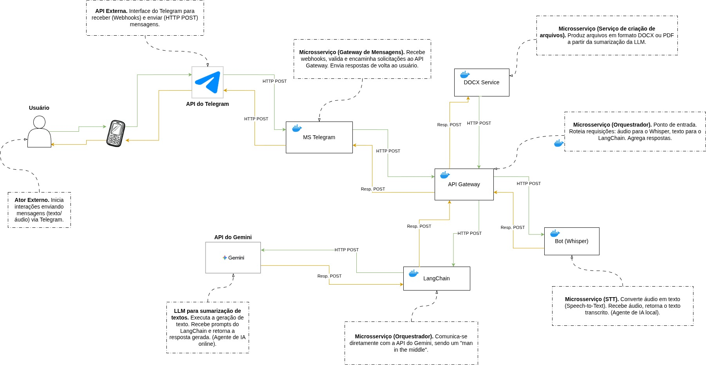

# 🧠 Sistema Distribuído para Análise Inteligente de Áudios de Reuniões

Este repositório contém o sistema desenvolvido para o núcleo de estudos **NIAD (Núcleo de Inteligência Artificial e Ciência de Dados)** como projeto acadêmico da disciplina **Sistemas Distribuídos** da **UFLA**.

O objetivo do sistema é realizar a **análise inteligente de áudios de reuniões recebidos via Telegram**, utilizando **múltiplos agentes de Inteligência Artificial** orquestrados em **microserviços containerizados**.

---

## 🧑‍💻 Desenvolvedores:

- [Gabriel Fagundes](https://github.com/gabrafo)
- [Gilmar Filho](https://github.com/gilmar-filho)
- [João Marcus](https://github.com/JoaoMarcus12)
- [Samuel Vanoni](https://github.com/SamuVanoni)

## 🚀 Principais Funcionalidades

### 🤖 Integração via Telegram

O **bot** atua como interface principal do sistema, recebendo áudios de reuniões dos usuários e enviando os resultados processados.

### 🎙️ Transcrição de Áudio (Whisper)

Microserviço **local e containerizado**, responsável por converter áudios em texto com o modelo open source **Whisper**, garantindo **privacidade e eficiência** no processamento inicial.

### 🧩 Orquestração (LangChain + API do Gemini)

Microserviço de orquestração. Utiliza o **LangChain** para gerenciar o fluxo, vetorizar textos e construir prompts, e se conecta à **API do Gemini** (um LLM remoto) para realizar a **sumarização inteligente** e geração de respostas.

### 🌐 API Gateway (Express.js)

Coordena o fluxo de dados entre os microserviços, centralizando o controle das requisições e assegurando **escalabilidade, segurança e flexibilidade**.

### 📄 DOCX Service (Python)

Extrai resumo criado pelo orquestrador e constrói um documento em PDF ou DOCX a partir dele, baseando-se em um template pré-estabelecido.

### 🐳 Containerização com Docker

Todos os componentes são **distribuídos em containers Docker**, facilitando **implantação, testes, manutenção e portabilidade** entre diferentes ambientes.

---

## Arquitetura do Projeto

---

## 🧱 Justificativa da Arquitetura Utilizada

A arquitetura foi projetada para atender aos requisitos de um **sistema distribuído moderno, seguro e escalável**, utilizando múltiplos agentes de IA de forma **orquestrada e independente**.

O uso de um **API Gateway** como controlador central permite o **desacoplamento lógico** entre os módulos, simplificando manutenção, escalabilidade e atualizações dos microserviços.

A separação dos agentes de IA em **serviços distintos** — um **agente local (Whisper)** para transcrição de áudio e um **orquestrador (LangChain)** que consome uma **IA remota (API do Gemini)** para sumarização — cumpre os requisitos acadêmicos de um sistema híbrido (local/remoto) e oferece **flexibilidade para evolução tecnológica**.

O **Bot do Telegram** foi escolhido por sua acessibilidade e ampla adoção, tornando a interação com o sistema intuitiva. O uso de **containers Docker** garante **isolamento, reprodutibilidade e portabilidade**, permitindo fácil implantação em diversos ambientes.

Além disso, a maior parte das tecnologias adotadas (**Docker, LangChain, Whisper, Express.js**) é **gratuita, open source e bem documentada**. O uso de uma API externa (Gemini) expõe o sistema a um modelo de ponta, mantendo a complexidade de infraestrutura baixa e focando no desafio de orquestração.

Por fim, o **desenho modular** favorece a aplicação de **conceitos de segurança** (como a modelagem de ameaças e a gestão de segredos), **validação de problema e documentação arquitetônica**, além de servir como **base sólida para futuras melhorias**, expansão de funcionalidades e integração de novos agentes de IA.